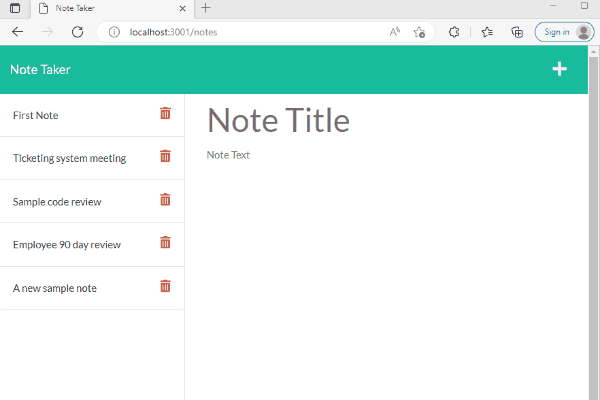

# Challenge 11 Express.js: Note Taker

## Badges
[](https://opensource.org/licenses/MIT)

## Description

This challenge is being used to showcase the training in Module 11 for Express.js, building server files and servers. We were given sample code that needed additional code to make this function as a working Note Taking site.

The mandatory files needed yet missing for this project to return a working Note Taker site are server.js, and route files, which I named htmlRoutes.js and apiRoutes.js. These then needed to be completed to allow the post, get, and for a bonus a delete HTTP request to work.

[Github Repository Link](https://github.com/jscobie/NoteTaker)<br>
[Heroku URL of the functional, deployed application](https://immense-everglades-35861.herokuapp.com/)<br>
[Git Hub Deployed page link (not functioning just repository site hosting readme file)](https://jscobie.github.io/NoteTaker/)

Animation of the working /notes page adding and deleting a note:<br>


## Table of Contents

* [Description](#description)
* [Installation](#installation)
* [Usage](#usage)
* [License](#license)
* [Tests](#tests)
* [Credits](#credits)
* [Questions?](#questions)

## Installation

Clone to your computer using SSH from GitHub:
```
git clone git@github.com:jscobie/NoteTaker.git
```

You'll also need to run to install the node required dependencies after you clone the install by running:
```
npm install
```

## Usage

The usage of this project is to allow myself to turn this project in for grading to the MSU Bootcamp academic grading team.

## License
Read more about [MIT license](https://opensource.org/licenses/MIT).

## Tests

Review Note Taker site is working once installed. To run Note Taker site after installation run the following command: 
```
npm start
```

## Credits

Credit to the MSU Bootcamp and instructors for training and training materials to resolve some of these issues.<br>
*Programs, packages used:*<br>
[Node.js](https://nodejs.org/en/)<br>
[Express.js](https://expressjs.com/)<br>

## Questions:
*Use the following options to contact me for questions:*<br>
[jscobie](https://github.com/jscobie)<br>
jscobie@focus-solutions.net